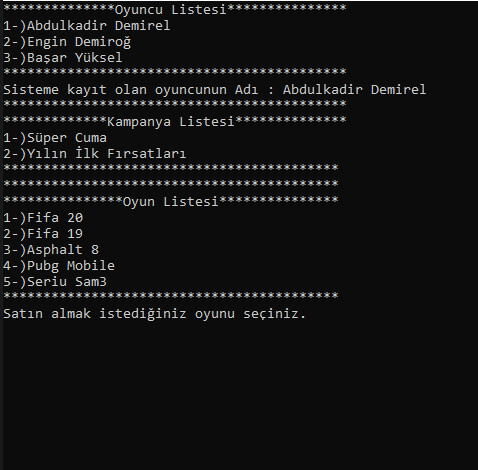
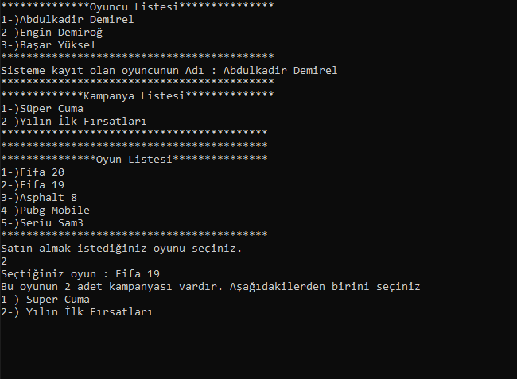
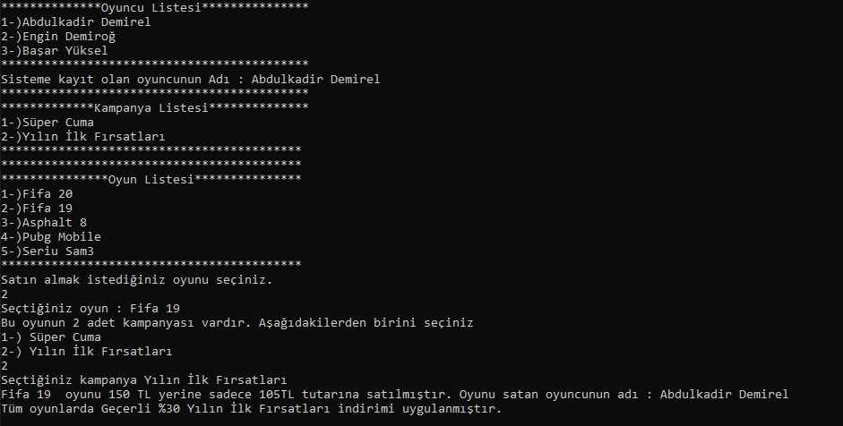

#  Ödev 5
Bir oyun yazmak istiyorsunuz. Bu yazılım için backend kodlarını C# ile geliştirmeyi planlıyoruz. Yeni üye, satış ve kampanya yönetimi yapılması isteniyor. Nesnelere ait özellikleri istediğiniz gibi verebilirsiniz. Burada amaç yazdığınız kodun kalitesidir. Ödevde gereksinimleri tam anlamadığınız durum benim için önemli değil, kendinize göre mantık geliştirebilirsiniz. Dediğim gibi kod kalitesiyle ilgileniyoruz şu an :)

Gereksinimler

1-)	Oyuncuların sisteme kayıt olabileceği, bilgilerini güncelleyebileceği, kayıtlarını silebileceği bir ortamı simule ediniz. Müşteri bilgilerinin doğruluğunu e-devlet sistemlerini kullanarak doğrulama yapmak istiyoruz. (E-devlet sistemlerinde doğrulama TcNo, Ad, Soyad, DoğumYılı bilgileriyle yapılır. Bunu yapacak servisi simule etmeniz yeterlidir.)

2-)	Oyun satışı yapılabilecek satış ortamını simule ediniz.( Yapılan satışlar oyuncu ile ilişkilendirilmelidir. Oyuncunun parametre olarak metotta olmasını kastediyorum.)

3-)	Sisteme yeni kampanya girişi, kampanyanın silinmesi ve güncellenmesi imkanlarını simule ediniz.

4-)	Satışlarda kampanya entegrasyonunu simule ediniz.

5-) Ödevinizi Github’a yükleyiniz. Github linkinizi paylaşınız.

Burada program çalıştırıldığında yapılan seçimlerin ekran görüntülerini ekledim. Program ilk açıldığında ekran sırayla önce Oyuncu Listesi sıralanır daha sonra benim backend tarafında belirlediğim oyuncu Mernis ile kontrol sağlanarak kayıt işlemi yapılır ardından kampanya listesi ve oyunların listesi gösterilir. Sonra satın alınmasını istediğimiz oyun için belirtilen seçeneklerden istenilen birine basılır.

Oyun seçimi yaptıktan onra uygun kampanya listesi tekrar karşımıza gelir ve seçim yapmamızı ister.

Seçim yapıldıktan sonra satın alınan oyun,satış tutarı,indirim oranı,oyunu satan oyuncunun adı ve kampanya adı kullanıcıya yazdırılır.

 

Ve proje burada sonlanır.
